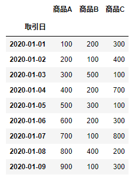
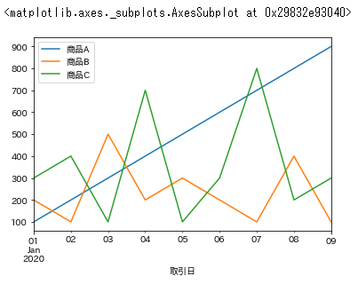
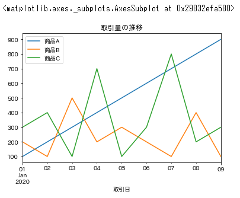
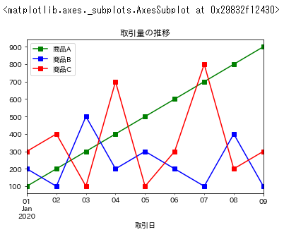
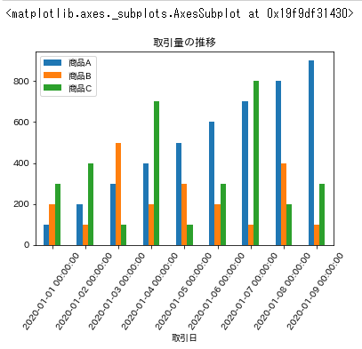
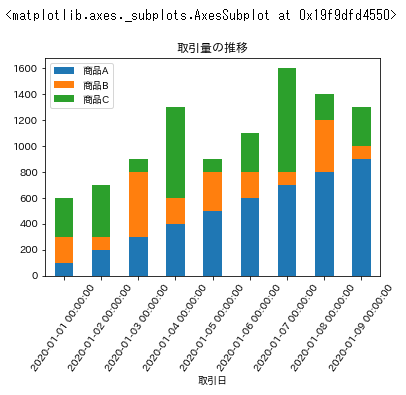
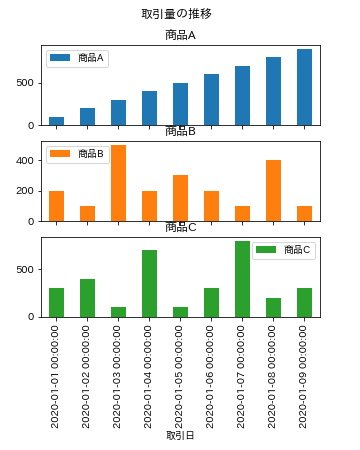

# 時系列データをグラフ化
時系列データを折線グラフや棒グラフで表示

<br>

## 日本語化ライブラリを追加
```
pip install japanize_matplotlib
```

<br>

## 時系列データを表示
```
frame1
```


<br>

## 時系列データをグラフ化
```
frame1.plot()
```


<br>

## グラフにタイトル付与
```
frame1.plot(title='取引量の推移')
```


<br>

## グラフの色を緑・青・赤、点を四角、線を点線に変更
```
frame1.plot(title='取引量の推移', style=['gs-', 'bs-', 'rs-'])
```


<br>

## 棒グラフに変更
```
frame1.plot(kind='bar', title='取引量の推移', rot=55)
```


<br>

## 積上げ棒グラフに変更
```
frame1.plot(kind='bar', title='取引量の推移', rot=55, stacked=True)
```


<br>

## グラフを分割
```
frame1.plot(kind='bar', title='取引量の推移', subplots=True, figsize=(5,5))
```


<br>
